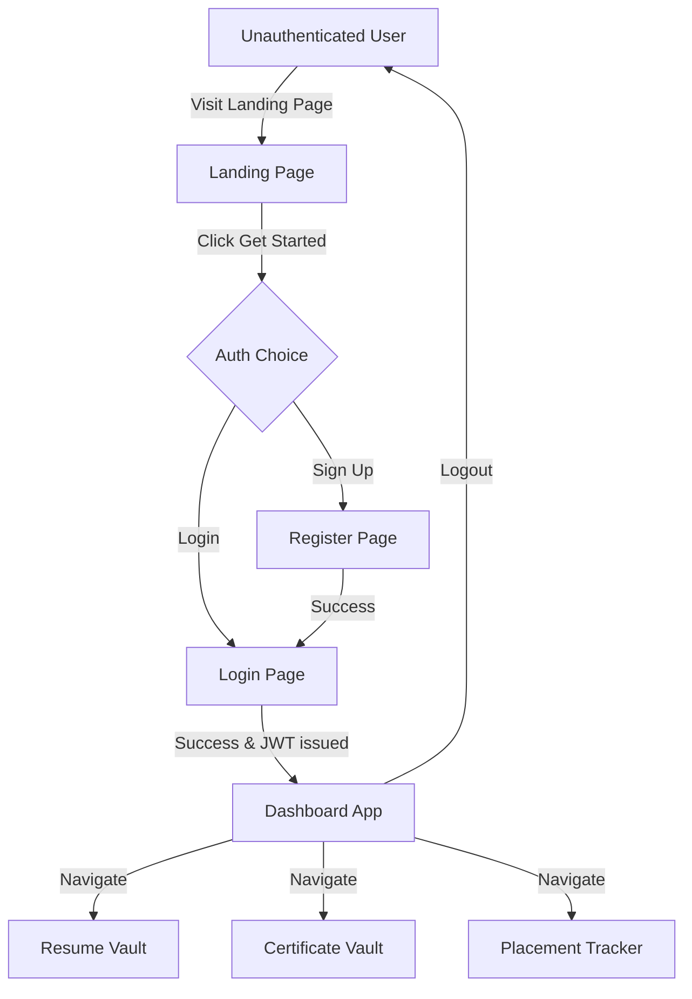

# Sprint 0: CareerVault AI Planning & Architecture

Welcome to the team! As your Tech Lead, I have designed this Sprint 0 blueprint to outline the core technical architecture, design patterns, and database schemas for **CareerVault AI**. This setup aligns with professional startup standards, ensuring our codebase is scalable, maintainable, and clean from day one.

---

## 1. Product Vision
**CareerVault AI** is a centralized professional asset vault designed specifically for tech students preparing for placements. In the initial phase (our MVP), it acts as a single source of truth where students can store their resumes, track job applications, and showcase verified certificates. In later phases, we will integrate AI models to analyze resumes, recommend improvements, and automate job matching.

---

## 2. Functional Requirements (MVP)

Here are the features we must deliver for the MVP:
1. **User Authentication**: Secure Sign-up, Login, and Logout using JSON Web Tokens (JWT) and cookies.
2. **Resume Vault**: Upload multiple resumes (PDF format), toggle an "Active" resume, and view basic metadata.
3. **Certificate Vault**: Store certificate credentials, verification URLs, and upload PDF/image proofs.
4. **Placement Tracker**: A Kanban-style board to track the application pipeline (Applied -> Test/OA -> Technical Interview -> HR Interview -> Offered / Rejected).
5. **Dashboard Analytics**: Visual counters for applications, interview rates, and active resume statistics.

---

## 3. Non-Functional Requirements

To ensure a production-grade experience, we will enforce:
- **Security**: Passwords hashed with `bcrypt`, APIs protected via JWT middleware, and protection against basic web vulnerabilities (XSS, CSRF).
- **Premium UI/UX**: Responsive modern dark-themed interface using Google Fonts (Outfit/Inter), glassmorphic styling, and clean animations (Framer Motion or custom CSS transitions). No basic default buttons!
- **Scalability**: Clean separation between Frontend and Backend (Client-Server architecture) so we can scale or deploy them independently.

---

## 4. User Flow



---

## 5. System Architecture (MERN Stack)

We will use a classic **Three-Tier Architecture**:
1. **Presentation Tier (Frontend)**: React.js (Vite) + Tailwind CSS + Axios. Handles the UI and user interactions.
2. **Application Tier (Backend)**: Node.js + Express.js. Implements the REST API, business logic, and authentication middleware.
3. **Data Tier (Database)**: MongoDB + Mongoose. Stores documents in a flexible JSON-like format.

### Tech Stack Selection & Trade-offs (Why MERN?)

Here is why we are using these specific technologies compared to others, and how they benefit your engineering growth and career preparation:

#### A. Frontend: React vs. Alternatives (Vanilla JS, Angular, Vue)
* **React**: A component-based UI library developed by Meta. It allows us to build Single Page Applications (SPAs) that update dynamically without refreshing the page.
* **Why React?**
  * **Industry Demand**: It is the most widely used frontend technology globally. Mastering React makes you highly competitive for placements.
  * **Virtual DOM**: Instead of manual DOM manipulation (which gets slow and buggy in Vanilla JS), React automatically computes the most efficient way to update the UI using its state-management system (`useState`).
* **Comparison**:
  * *Vanilla JS*: Hard to manage UI state in large applications.
  * *Angular*: High complexity and a steep learning curve. Requires TypeScript and rigid structures from day one.
  * *Vue*: Good framework, but the job market is significantly smaller than React's.

#### B. Backend: Node.js & Express vs. Alternatives (Python/Django, Java/Spring Boot)
* **Node.js & Express**: Node.js allows us to run JavaScript on the server. Express is a lightweight framework to handle routing and HTTP requests.
* **Why Node & Express?**
  * **Unified Language (JavaScript)**: Using JS on both the frontend and backend eliminates the need to context-switch between languages, accelerating your learning curve.
  * **Event-Driven & Non-Blocking**: Highly performant and standard for high-concurrency real-time systems.
* **Comparison**:
  * *Python (Django/FastAPI)*: Excellent for ML/Data Science, but requires switching between JavaScript (frontend) and Python (backend).
  * *Java (Spring Boot)*: Heavy enterprise tool, requires extensive boilerplate code, which is slow for prototyping.

#### C. Database: MongoDB vs. Alternatives (SQL databases like MySQL/PostgreSQL)
* **MongoDB**: A NoSQL document database storing data in JSON-like formats (BSON).
* **Why MongoDB?**
  * **Schema Flexibility**: Professional assets like resumes and certificates have variable fields. MongoDB lets us store documents with differing shapes without demanding database migrations.
  * **Native JS Integration**: Since we query and retrieve data in JSON format, it integrates seamlessly with our JavaScript backend.
* **Comparison**:
  * *SQL (PostgreSQL/MySQL)*: Requires a fixed schema. Adding a new column (like certificate verification ID) requires writing database migrations, which slows down prototyping.

---

## 6. Database Schema (MongoDB)

Here is how our MongoDB collections are structured. Since we are using MongoDB, which is document-oriented, we use **Mongoose** to enforce a schema.

### User Collection
Stores account information.
```json
{
  "_id": "ObjectId",
  "name": "String (Required)",
  "email": "String (Unique, Required, Indexed)",
  "password": "String (Hashed using bcrypt, Required)",
  "createdAt": "Date",
  "updatedAt": "Date"
}
```

### Resume Collection
Stores resume metadata. PDF files will be stored in Cloudinary (cloud storage), and we will store the Cloudinary URL.
```json
{
  "_id": "ObjectId",
  "userId": "ObjectId (Reference -> User, Indexed)",
  "title": "String (Required)",
  "fileUrl": "String (Required)",
  "cloudinaryPublicId": "String (Required)",
  "isActive": "Boolean (Default: false)",
  "createdAt": "Date"
}
```
> [!NOTE]
> **Why do we store `cloudinaryPublicId`?** If the user deletes a resume from CareerVault, we must use this ID to delete the physical file from Cloudinary as well. Failing to do this causes "orphaned files" which will bloat our cloud storage bill.

### Certificate Collection
Stores certifications.
```json
{
  "_id": "ObjectId",
  "userId": "ObjectId (Reference -> User, Indexed)",
  "title": "String (Required)",
  "issuer": "String (Required)",
  "issueDate": "Date",
  "credentialId": "String",
  "verificationUrl": "String",
  "fileUrl": "String (Optional, Cloudinary URL)",
  "createdAt": "Date"
}
```

### Application Collection
Tracks job application statuses.
```json
{
  "_id": "ObjectId",
  "userId": "ObjectId (Reference -> User, Indexed)",
  "companyName": "String (Required)",
  "role": "String (Required)",
  "status": "String (Enum: ['Applied', 'OA', 'Interviewing', 'Offered', 'Rejected'])",
  "salary": "Number (Optional)",
  "jobDescriptionUrl": "String",
  "notes": "String",
  "appliedDate": "Date (Default: Date.now)",
  "updatedAt": "Date"
}
```

---

## 7. Scalable Folder Structure

To avoid spaghetti code, we will separate the codebase into two top-level directories: `frontend` and `backend`.

```text
careervault-ai/
├── backend/
│   ├── config/            # Database and Cloudinary connections
│   ├── controllers/       # Controller functions (business logic)
│   ├── middleware/        # JWT auth and file upload verification
│   ├── models/            # Mongoose schemas
│   ├── routes/            # Express routes (mapping endpoints to controllers)
│   ├── utils/             # Helper helper functions
│   ├── .env               # Environment secrets (ignored in Git!)
│   ├── package.json       # Node dependencies
│   └── server.js          # Entry point for backend app
├── frontend/
│   ├── public/            # Static assets
│   ├── src/
│   │   ├── assets/        # Global stylesheets and local images
│   │   ├── components/    # Reusable UI components (Navbar, Button, Card)
│   │   ├── context/       # AuthState management
│   │   ├── pages/         # Page components (Dashboard, Vaults, Landing)
│   │   ├── services/      # Axios API service instances
│   │   ├── App.jsx        # Routing & main container
│   │   └── main.jsx       # React DOM entry point
│   ├── .env               # Frontend environment variables
│   ├── index.html
│   ├── tailwind.config.js # Tailwind CSS design token configurations
│   ├── vite.config.js     # Bundler configuration
│   └── package.json       # React dependencies
└── README.md              # Project documentation
```

---

## 8. API Planning (REST endpoints)

All endpoints will be prefixed with `/api`.

| Route | Method | Description | Auth Required? |
|---|---|---|---|
| `/api/auth/register` | `POST` | Registers a new user | No |
| `/api/auth/login` | `POST` | Logs in and returns JWT | No |
| `/api/auth/me` | `GET` | Validates JWT & returns user profile | Yes |
| `/api/resumes` | `POST` | Uploads a new resume | Yes |
| `/api/resumes` | `GET` | Fetches all resumes for the user | Yes |
| `/api/resumes/:id` | `DELETE`| Deletes a resume | Yes |
| `/api/resumes/:id/active`| `PATCH`| Sets a resume as the active one | Yes |
| `/api/certificates` | `POST` | Adds a certificate | Yes |
| `/api/certificates` | `GET` | Fetches all certificates | Yes |
| `/api/certificates/:id` | `DELETE`| Deletes a certificate | Yes |
| `/api/applications` | `POST` | Creates a job application tracker | Yes |
| `/api/applications` | `GET` | Fetches all job trackers | Yes |
| `/api/applications/:id` | `PUT` | Updates status or details of a tracker | Yes |
| `/api/applications/:id` | `DELETE`| Deletes a job tracker | Yes |

---

## 9. UI Wireframes (Concept)

### Dashboard Page (Layout)
```text
+--------------------------------------------------------------+
|  [Logo] CareerVault AI               [Resumes] [Tracker] (Me)|
+--------------------------------------------------------------+
|  Welcome back, User!                                         |
|                                                              |
|  +-----------------+  +-----------------+  +--------------+  |
|  | Applications    |  | Interview Rate  |  | Active CV    |  |
|  |       24        |  |      35.2%      |  |  CV_July.pdf |  |
|  +-----------------+  +-----------------+  +--------------+  |
|                                                              |
|  Recent Job Applications (Quick list)                        |
|  - Google | Software Engineer Intern | OA stage              |
|  - Stripe | Frontend Dev             | Applied               |
+--------------------------------------------------------------+
```

---

## 10. GitHub Repository Setup

We will set up our local Git repository in Sprint 0. Here are the commands you will run:
1. `git init` - Initializes a new Git repository.
2. Create `.gitignore` files to prevent uploading node modules and API keys/secrets to GitHub.
3. `git add .` - Stages files.
4. `git commit -m "chore: initial project blueprint and planning"` - Saves the checkpoint locally.

---

## 11. Development Roadmap

- **Sprint 0**: Planning, Folder Setup, Environment Setup (Current)
- **Sprint 1**: Frontend Skeleton, Landing Page, Authentication UI, Dashboard UI
- **Sprint 2**: Backend Server, Database Setup, JWT Authentication implementation
- **Sprint 3**: Resume Vault Feature (PDF uploads, Cloudinary integration, Active Toggle)
- **Sprint 4**: Certificate Vault Feature (Adding certificates, displaying proofs)
- **Sprint 5**: Placement Tracker Kanban Board (State updates, drag/drop UI)
- **Sprint 6**: Analytics Dashboard & Chart Integration (Recharts)
- **Sprint 7**: Deployment (Vercel & Render) & Final Polish

---

## 12. Study Guide (Preparation for Sprint 1)
To get ready for Sprint 1, read or watch the following:
1. **React Components & JSX** (15 mins): [React Documentation: Describing the UI](https://react.dev/learn/describing-the-ui)
2. **React state (`useState`)** (15 mins): [React Documentation: State: A Component's Memory](https://react.dev/learn/state-a-components-memory)
3. **Tailwind CSS Basics** (15 mins): [Tailwind CSS Utility-First Fundamentals](https://tailwindcss.com/docs/utility-first)
4. **React Router basics** (15 mins): [React Router Tutorial Intro](https://reactrouter.com/en/main/start/tutorial)

---

## Open Questions for You
> [!IMPORTANT]
> 1. **MongoDB Setup Preference**: Do you have a local MongoDB Community Server installed on your machine, or would you prefer to use **MongoDB Atlas** (a free, managed cloud database service)? MongoDB Atlas is generally recommended for startups and easy hosting later.
> 2. **Design Style**: Do you prefer a sleek, dark-themed layout (like Vercel or Linear) or a clean, modern white-and-indigo interface? We will use a curated theme.
